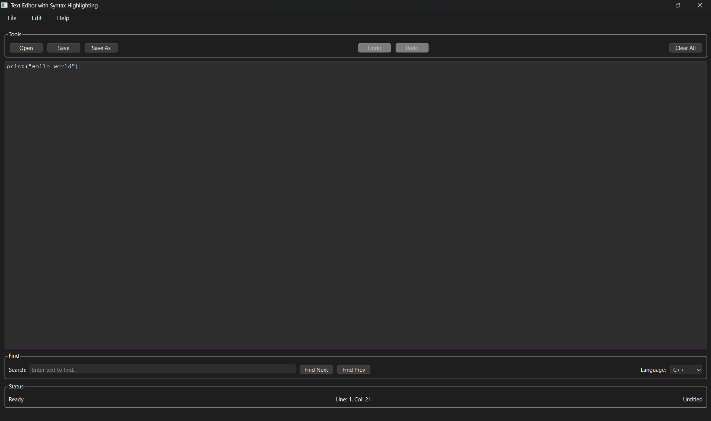

# Текстовый редактор с подсветкой синтаксиса

## Описание проекта

Текстовый редактор с подсветкой синтаксиса представляет собой десктопное приложение, предназначенное для создания и редактирования текстовых файлов с исходным кодом. Продукт выступает в роли легковесного инструмента для разработчиков и студентов, обеспечивая базовый комфорт работы с программным кодом за счет визуального выделения синтаксических конструкций. Приложение работает локально на компьютере пользователя, не требует постоянного подключения к сети и ориентировано на быстрое открытие, модификацию и сохранение файлов различных языков программирования. Архитектура системы построена с учетом возможности расширения функционала через внешние конфигурации, что позволяет адаптировать продукт под новые языки без внесения изменений в исполняемый код.

## Требования

- CMake 3.19+
- Qt6 6.5+ (Qt6Core, Qt6Gui, Qt6Widgets)
- C++ компилятор с поддержкой C++17

## Инструкция по сборке

Проект компилируется и запускается без ошибок командами:

```bash
cmake -S . -B build
cmake --build build
cd build
.\MyTextEditor.exe
```

TextEditor/ 

├── CMakeLists.txt 

├── README.md 

├── src/ 

│ ├── main.cpp 

│ └── modules/ 

│ ├── editor/ 

│ ├── command/ 

│ ├── syntaxhighlighter/ 

│ ├── filemanager/ 

│ ├── searchmanager/ 

│ └── mainwindow/ 

└── resources/

